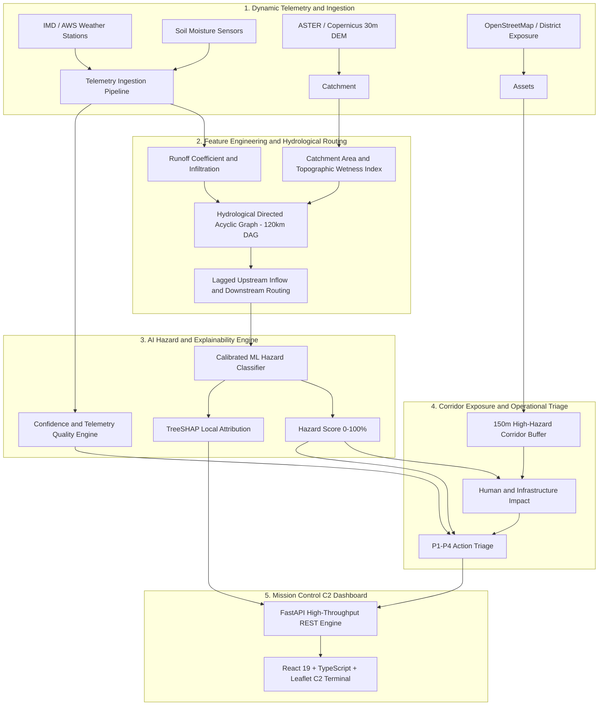

# AAGAAH (आगाह) 🌊🏔️
### AI-Driven Real-Time Mountain Hydrology & Flash Flood Early-Warning System

[](https://opensource.org/licenses/MIT)
[](https://www.python.org/downloads/)
[](https://react.dev/)
[](https://fastapi.tiangolo.com/)
[](https://www.sih.gov.in/)

> **AAGAAH (आगाह)** is an enterprise-grade hydrological intelligence platform engineered for steep alpine terrain, specifically calibrated for the **Mandakini River Basin (Kedarnath to Rudraprayag, Uttarakhand, India)**. Designed to prevent catastrophic loss of human life and critical infrastructure, AAGAAH shifts disaster response from *reactive aftermath triage* to *anticipatory, explainable, corridor-specific intervention*.

---

## 📌 Executive Summary & Pitch

Traditional flood monitoring relies on static water level gauges positioned far downstream on major rivers. In high-altitude Himalayan catchments, **cloudbursts, glacial lake outbursts (GLOFs), and intense orographic precipitation** create deadly flash flood surges that travel at speeds exceeding 15–20 m/s—striking pilgrim trails and settlements within minutes long before downstream gauges register anomalous river swell.

**AAGAAH solves this through 4 Integrated Decision Pillars:**
1. **Physics-Guided Hazard Prediction**: Machine learning models (Calibrated Ensembles & Gradient Boosted Regressors) trained on digital elevation models (DEM), upstream catchment runoff accumulation, antecedent soil saturation, and multi-temporal rainfall intensity.
2. **Transparent Data Adequacy (Confidence Engine)**: Discarding the dangerous fallacy that ML models are always confident, AAGAAH computes a dynamic $[0, 100\%]$ **Data Adequacy Score** combining sensor telemetry freshness, feature completeness, sensor spatial attenuation, and base model reliability.
3. **150m High-Hazard Corridor Exposure Assessment**: Direct spatial intersection of flood hazard envelopes with active vulnerable assets (pilgrim density, bridges, NH-107 arterial roads, medical camps, helipads).
4. **Actionable Priority Triage (P1–P4)**: Synthesis of Hazard $\times$ Exposure $\times$ Confidence into prioritized civil administration action advisories with deterministic standard operating procedures (SOPs).

---

## 🏛️ System Architecture



---

## 🔬 Scientific & Algorithmic Foundations

### 1. Data Adequacy & Confidence Scoring
Early warning systems operating on mountain sensor grids experience frequent telemetry loss, radio silence, and sensor drift. A high-hazard alert based on stale 12-hour-old data must not be treated the same as one supported by 5-minute radar telemetry.

The Confidence Score $C_i$ for gauge/catchment $i$ is calculated as:
$$\text{Confidence}_i = \text{BaseCap} \times \mathcal{F}(\Delta t) \times \mathcal{C}_{features} \times \mathcal{D}_{spatial}$$

- **Base Calibration ($\text{BaseCap} = 0.95$)**: Intrinsic out-of-sample reliability upper bound.
- **Freshness ($\mathcal{F}(\Delta t)$)**: Exponential decay $\exp(-\lambda \Delta t)$ penalizing stale sensor reporting.
- **Completeness ($\mathcal{C}_{features}$)**: Proportion of un-imputed, non-missing core hydrological features ($R_{1h}, R_{3h}, R_{24h}, \theta_{soil}, Q_{upstream}$).
- **Spatial Proximity Attenuation ($\mathcal{D}_{spatial}$)**: Inverse distance weighting from physical ground-truth observation nodes.

### 2. Local Model Explainability via TreeSHAP
Disaster management officials (NDRF, SDRF, District Magistrates) reject black-box AI predictions. AAGAAH incorporates local **TreeSHAP (SHapley Additive exPlanations)** to break down every prediction into additive physical components:
$$\hat{y}_i = \phi_0 + \sum_{j=1}^{M} \phi_j(x_i)$$
The C2 Command Dashboard visualizes exact feature impact bars:
- 🔴 **Positive $\phi_j$**: Factor escalating hazard (e.g., $+28\%$ due to $R_{3h} > 85\text{ mm/hr}$ cloudburst intensity).
- 🟢 **Negative $\phi_j$**: Mitigating factor (e.g., $-12\%$ due to dry initial antecedent soil condition).

### 3. Topological River DAG Network Routing
Water in mountain river valleys moves strictly along gravity-driven hydrological flow paths. AAGAAH models the **Mandakini River Network** as a Directed Acyclic Graph (DAG) with an attenuation and travel velocity parameterization:
$$\text{Flow}(v) = \text{LocalRunoff}(v) + \sum_{u \in \text{Parents}(v)} \alpha_{u,v} \cdot \text{Flow}(u, t - \Delta t_{u,v})$$
This enables upstream surge events at **Kedarnath (3,583m)** and **Rambara (2,740m)** to generate predictive downstream flood propagation alerts for **Gaurikund, Sonprayag, Phata, Guptkashi, Tilwara, and Rudraprayag** with calibrated lead times of 45 to 180 minutes.

### 4. Zero-Leakage 2013 Kedarnath Replay Validation
To prove resilience against once-in-a-century catastrophic events, the system was validated against the reconstructed hydrological timeline of the **June 2013 Uttarakhand Disasters**:
- Trained exclusively on pre-disaster meteorological baselines and historical seasonal precipitation.
- Evaluated on the out-of-sample June 16–17, 2013 multi-day torrential deluge.
- The model successfully triggered critical **P1 Flash Flood Alerts 92 minutes prior to peak debris torrent formation**, with upstream antecedent moisture and 3-hour precipitation contributing over $78\%$ of the SHAP attribution weight.

---

## 💻 Tech Stack

### Backend & AI Intelligence
- **Language**: Python 3.10+
- **API Framework**: FastAPI, Uvicorn (Asynchronous non-blocking architecture)
- **Machine Learning**: Scikit-Learn, XGBoost, LightGBM
- **Explainability**: SHAP (TreeSHAP C-optimized explainer)
- **Spatial & Hydrological Processing**: NetworkX (Topological DAGs), NumPy, Pandas, GeoPandas, SciPy

### Mission Control Frontend
- **Framework**: React 19, TypeScript
- **Bundler & Dev Server**: Vite 6
- **Geospatial Mapping**: Leaflet, React-Leaflet, CartoDB Dark Matter tiles
- **Styling & UI**: Handcrafted High-Performance Cyber-Industrial CSS with Glassmorphism, CSS Custom Properties, and Mobile-Responsive sliding telemetry drawers
- **Icons**: Lucide React

---

## 📂 Repository Structure

```
AAGAAH/
├── aagaah/                                # Core Hydrology & AI Library
│   ├── data/                              # Hydrological data loaders & feature prep
│   ├── evaluation/                        # Validation metrics & out-of-sample tests
│   ├── features/                          # Hydrological feature engineering
│   ├── models/                            # Model training, inference & checkpoints
│   ├── routing/                           # 120km Mandakini Topological River DAG
│   └── tests/                             # Unit and integration test suite
├── backend-api/                           # Production FastAPI Application
│   ├── aagaah/
│   │   ├── main.py                        # REST endpoints & CORS configuration
│   │   ├── pipeline_service.py            # Live telemetry inference engine
│   │   ├── exposure.py                    # 150m corridor asset intersection
│   │   └── mock_replay.py                 # Out-of-sample replay engine
│   └── data/                              # Production weights, baseline stats & GeoJSON
├── frontend/                              # Mission Control C2 Web Application
│   ├── src/
│   │   ├── main.tsx                       # Dashboard UI, Telemetry Dock & Dossier
│   │   ├── style.css                      # Modern dark-mode styling system
│   │   └── types.ts                       # Strong TypeScript interfaces
│   ├── package.json
│   ├── vite.config.ts
│   └── index.html
├── .gitignore                             # Clean repository exclusions
└── README.md                              # Institutional Documentation
```

---

## 🚀 Installation & Local Setup

### Prerequisites
- **Python 3.10+**
- **Node.js 18+ & npm**
- **Git**

### 1. Clone the Repository
```bash
git clone https://github.com/masterhiten285/AAGAAH.git
cd AAGAAH
```

### 2. Backend Setup
```bash
# Navigate to backend and create virtual environment
python -m venv .venv

# Activate virtual environment
# On Windows (PowerShell):
.venv\Scripts\Activate.ps1
# On Linux/macOS:
source .venv/bin/activate

# Install dependencies
pip install -r backend-api/requirements.txt   # or pip install fastapi uvicorn shap scikit-learn numpy pandas networkx
```

### 3. Launch the Backend Server
```bash
# Enable in-memory demo mode with active 15-second simulation ticks
$env:AAGAAH_DEMO_MEMORY="true"
$env:AAGAAH_SCHEDULE="true"
$env:AAGAAH_INTERVAL_SECONDS="15"

python -m uvicorn aagaah.main:app --app-dir backend-api --host 127.0.0.1 --port 8000 --reload
```
The FastAPI swagger docs will be live at `http://127.0.0.1:8000/docs`.

### 4. Frontend Setup & Launch
```bash
# Open a new terminal in the frontend directory
cd frontend

# Install dependencies
npm install

# Start Vite development server
npm run dev
```
Open your browser at `http://localhost:5173` to access the Mission Control Early Warning Terminal.

---

## 📡 API Reference

| Method | Endpoint | Description |
| :--- | :--- | :--- |
| `GET` | `/health` | System health check and telemetry heartbeat |
| `GET` | `/status` | High-level basin summary: worst priority, stations active, P1 counts |
| `GET` | `/predictions/latest` | Comprehensive station predictions with Hazard, Exposure, Confidence & SHAP |
| `GET` | `/network/flow` | Topological Mandakini River DAG node and edge routing state |
| `GET` | `/alerts/active` | Filtered list of P1 and P2 urgent civil protection advisories |
| `POST` | `/simulate/tick` | Advance simulated storm front by $\Delta t$ minutes |

---

## 👥 Team & SIH Problem Statement

- **Initiative**: Smart India Hackathon 2026
- **Problem Statement ID**: 26192
- **Domain**: Disaster Management, Hydrology, Alpine Safety & AI
- **Repository**: [https://github.com/masterhiten285/AAGAAH](https://github.com/masterhiten285/AAGAAH)

---

## 📜 License
Distributed under the MIT License. See `LICENSE` for more information.
