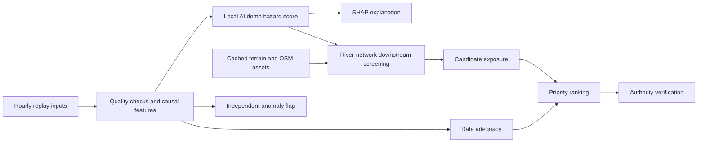

# AAGAAH (आगाह)

**Flash Flood Intelligence & Early Warning System — decision-support prototype**
SIH 2026 · Problem Statement 26192 · Pilot: Mandakini Basin, Uttarakhand

## Problem

Authorities need to connect upstream environmental conditions to specific downstream places that deserve verification. Mountain rainfall varies sharply; observations can be incomplete or late; river connectivity and the location of crossings and settlements matter. A rainfall value alone cannot answer which location needs attention first.

## Solution

AAGAAH brings environmental features, an explainable hazard model, river-network screening and mapped asset exposure into one authority dashboard. It is a decision-support and last-mile intelligence layer for authorized authorities, with human verification and local protocols governing action.

**Current implementation is an explicitly labeled synthetic replay demonstration.** Live monitoring is not connected. The trained model uses artificial targets; its output is a demo hazard score, not a validated probability of flooding. Historical accuracy and warning lead time are not established.

## How it works



Keep four concepts separate: **hazard** is a local model output; **data adequacy** describes evidence freshness/completeness; **exposure** counts mapped candidate assets; **priority** orders locations for review. An anomaly means unusual conditions, not a confirmed flood.

Read the [pre-change audit and architecture map](docs/ARCHITECTURE.md), [AI explanation](docs/ML_EXPLAINABILITY.md) and [GIS/risk methodology](docs/GIS_RISK.md).

## What is unique

The prototype connects explainable local scores to downstream river geography, candidate assets and an explicit review queue. It retains provenance, missing inputs and low-adequacy review flags. The judge can trace a result from data to AI to GIS to human verification without reading the source code. This describes the implementation, not a proven comparative performance advantage.

## Demo

Open the Mandakini map, choose **Start judge demo**, then **Open synthetic storm at hour 30**. Inspect the four evidence cards, SHAP drivers, connected locations and matched assets. Review **Data Sources & Freshness** and **Model & Validation**, then export a labeled authority review draft. **Live monitoring** explicitly shows unavailable current conditions.

The replay uses 2013 dates as narrative context; it does not reconstruct the real flood. The separate cached reanalysis adapter supplies one Kedarnath grid point and is exercised by the replay-check script. It is not the default dashboard input. See the [3-minute script, 30-second explanation and judge Q&A](docs/DEMO_GUIDE.md).

### Local setup (PowerShell, from this repository root)

Python 3.11+ and Node/npm are needed. Start with the existing processed data under `SIH/aagaah/data/processed`; do not rerun downloads merely to view the demo.

```powershell
python -m venv .venv
.\.venv\Scripts\python.exe -m pip install -r SIH/aagaah/requirements.txt
cd SIH/aagaah
$env:AAGAAH_DEMO_MEMORY='true'
$env:AAGAAH_SCHEDULE='true'
$env:AAGAAH_INTERVAL_SECONDS='8'
..\..\.venv\Scripts\python.exe -m uvicorn aagaah.main:app --app-dir backend-api --host 127.0.0.1 --port 8000
```

In another terminal, from the repository root:

```powershell
cd SIH/aagaah/frontend
npm ci
npm run dev
```

Open [the dashboard](http://127.0.0.1:5173) and [API documentation](http://127.0.0.1:8000/docs). The API generates deterministic synthetic model artifacts if absent. Memory-demo storage is nonpersistent and never selected automatically after a database failure.

If a port is already occupied, use another backend port and set `AAGAAH_API_PROXY` for Vite:

```powershell
$env:AAGAAH_API_PROXY='http://127.0.0.1:8011'
node node_modules/vite/bin/vite.js --host 127.0.0.1 --port 5181 --strictPort
```

Change the replay token with `AAGAAH_CONTROL_TOKEN`, then enter the same value in the dashboard's **Replay control token** section. Replay mutations affect shared server state. Without a scheduler or worker, use step/seek; Play alone does not advance time.

### Persistent deployment configuration

The existing Compose stack uses PostGIS, Redis, FastAPI, a replay-tick worker and nginx. From `SIH/aagaah`, `docker compose up --build` exposes the UI on port 8080 and API on port 8000. It runs Alembic migration and seeds cached geometry. This is a configured prototype deployment, not a claim of operational readiness. Do not enable both the separate replay worker and API scheduler for the same deployment.

## Technology

React + TypeScript + React Query + MapLibre; FastAPI + Pydantic; XGBoost + Isolation Forest + SHAP; Rasterio + Shapely + PyProj + NetworkX; PostgreSQL/PostGIS + optional Redis; pytest + Playwright. Existing model, formula, storage adapters and API defaults are retained.

| API | Purpose |
|---|---|
| GET `/health` | Actual storage/cache status, model readiness and API scheduler configuration |
| GET `/pilot`, `/sources`, `/model-card` | Pilot metadata, source usage/probes, loaded model evidence |
| GET `/dashboard` or `?mode=replay` | Committed replay snapshot |
| GET `/dashboard?mode=live` | Explicit HTTP 503: live monitoring not connected |
| GET `/map/{layer}` | `catchments`, `rivers`, `flowpaths`, `infrastructure`, `screening-corridor` |
| GET `/map/terrain.png` | Cached hillshade |
| GET `/locations/{id}/history` | Recorded replay frames through the active replay time |
| POST `/predict` | Shared causal pipeline on supplied readings; does not persist a live dashboard |
| POST `/replay/control` | Token-protected play, pause, step, seek or reset |
| POST `/internal/tick` | Token-protected scheduled replay tick |

There are no implemented incident-dispatch, government warning or situation-summary endpoints. Review-draft export is a local browser download.

## Validation

The model card contains **no historical performance metrics**. ROC-AUC, PR-AUC, Brier score, F1, precision and recall remain **not established**. Three grouped synthetic smoke checks demonstrate pipeline mechanics; they are not event-level flood validation. See [validation methodology and test instructions](docs/VALIDATION.md).

```powershell
# From SIH/aagaah
..\..\.venv\Scripts\python.exe -m pytest -q
..\..\.venv\Scripts\python.exe scripts/replay_check.py
cd frontend
npm run build
npm run test:e2e
```

Browser tests need a running API with a replay scheduler and Vite proxy. Set `AAGAAH_UI_URL` if the UI is not on port 5173. Real PostGIS integration requires `AAGAAH_TEST_DATABASE_URL` pointing to a migrated test database; it is skipped otherwise. See [change and verification record](docs/IMPLEMENTATION_REPORT.md).

## Limitations

No connected live monitoring, real flood-trained model, calibrated probabilities, validated warning lead time, hydraulic simulation or autonomous evacuation. GIS uses 120m terrain analysis and **illustrative per-edge attenuation**, not physical distance decay. The **150m corridor is candidate exposure screening, never an inundation boundary**. OSM completeness is unknown; roads are feature counts, population is unknown and cached infrastructure is not a 2013 inventory. See [all limitations](docs/LIMITATIONS.md) and [data-source usage](docs/DATA_SOURCES.md).

## Future scope

Connect authorized weather/gauge feeds with explicit availability times; assemble independent flood and non-flood labels; perform event/time/basin-held-out evaluation and calibration; validate terrain and asset inventories; assess mechanism-specific model needs; co-design review and escalation workflows with authorities. These are planned work, not operational integrations. AAGAAH does not replace IMD, NDRF or SAsiaFFGS.
