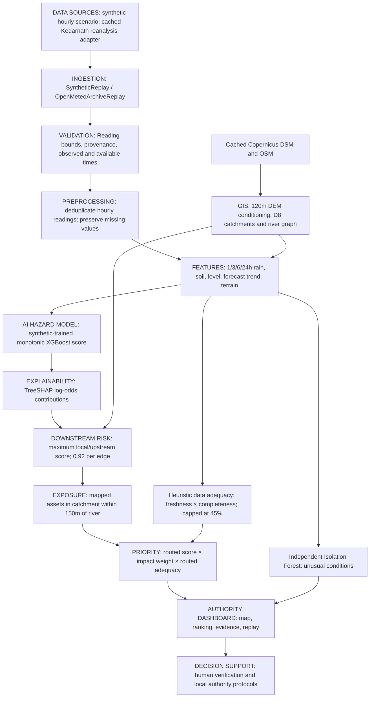

# AAGAAH architecture — repository audit

Audit recorded before implementation changes, 12 September 2026. Application root: `SIH/aagaah`.

The default dashboard uses **synthetic replay**, not the archive adapter or live observations. The graph uses **per-edge attenuation**, not distance-based decay, hydraulics, inundation depth, or travel time. Geographic edge lengths exist but do not drive attenuation.

## Audit by subsystem

| Subsystem | Implementation and finding |
|---|---|
| Backend/API | FastAPI `backend-api/aagaah/main.py`; shared `pipeline.py`; explicit storage selection; token-protected replay mutations. |
| Ingestion | `providers.py`: deterministic synthetic replay and one-grid-point cached reanalysis. Government adapters raise explicit planned-provider errors. `data-ingestion/worker.py` advances replay; it does not fetch live weather. |
| Quality/preprocessing | `contracts.py`, `processing.py`: bounded, timezone-aware readings; reject future/unavailable/nonhourly records; latest-available duplicate wins; exact hourly accumulation requires complete window; no silent zero filling. |
| ML | `model.py`: 2,400 synthetic rows, artificial severity labels, seed 2026; 11 features; 90-tree monotonic XGBoost. Existing artifacts and model card identify `synthetic-demo-v1`. |
| Validation | Three GroupKFold smoke checks on artificial groups; no real event validation and no performance metrics. `evaluate_historical.py` checks a manifest and exits without fitting/evaluation. |
| Anomaly | Independent Isolation Forest on synthetic normal-condition examples; 8% contamination. Median imputation supports its input; anomaly is not confirmation of flood or sensor failure. |
| Explanation | TreeSHAP explains the local classifier in log-odds. It does not explain routed priority or establish physical causality. |
| GIS | `scripts/prepare_pilot.py`, `hydrology.py`: Copernicus 30m DSM resampled to 120m metric grid, priority-flood conditioning, D8 accumulation, incremental catchments and connected outlets. |
| Propagation | `spatial.py`: maximum of local score and upstream routed score × 0.92, with adequacy × 0.95 per edge; downstream-only DAG. |
| Exposure | Catchment intersection plus 150m mapped-river proximity; cached OSM asset counts, no population estimates or inundation footprints. Roads count features, not kilometres. |
| Priority | Routed score × [1 + log(1 + settlements + roads + 2×bridges + 5×hospitals)] × routed adequacy. Warning/Critical/Unknown and stale locations retain review flags. |
| Replay/live | Replay has reset, seek, step, play/pause, scheduler, stored history. Before this change `/dashboard?mode=live` silently returned replay because the parameter was ignored. No live ingestion/dashboard workflow exists. |
| Storage | `db.py`: PostgreSQL/PostGIS observations, snapshots, history, catchments, assets, rivers, network edges; advisory transaction lock; optional Redis keyed by committed run ID. Explicit nonpersistent memory/local-spatial demo; database failure never selects it automatically. |
| Configuration | `config.py`, `.env.example`, Compose; local memory must be enabled deliberately; scheduler defaults off; control token and CORS configurable. Compose uses separate replay worker. |
| Frontend | React, TypeScript, React Query, MapLibre. Map layers, selection, replay API, sources work. Large main component contains unsupported metrics, live labels, population/asset fallbacks, event claims, and incident/briefing endpoints absent from backend. These are presentation defects/dead UI, not implemented capabilities. |
| Tests/docs | Backend tests cover causal windows, model/SHAP, independent anomaly, hydrology, routing, API and optional real PostGIS. Existing browser tests target an earlier UI. README includes obsolete endpoints/setup and unsupported scientific claims; source-probe notes and replay walkthrough are more candid. |

## Existing API contract

GET `/health`, `/pilot`, `/sources`, `/model-card`, `/dashboard`, `/map/terrain.png`, `/map/{layer}`, `/locations/{location_id}/history`; POST `/predict`, `/replay/control`, `/internal/tick`. `/predict` computes supplied readings without persisting them as the dashboard state. Replay state is shared by all clients, not a private browser session.

## Scoped implementation plan

Preserve the model, risk formula, database adapters, API defaults, causal pipeline and MapLibre renderer. Refactor the dashboard around available evidence; remove fabricated/dead panels; make unavailable live mode explicit; add a truthful source usage view, technical model card, screening geometry and judge demo guidance. Add regression checks for provenance, live/replay separation, missing data, map layers and authority wording. No new scientific model or government integration is implied.
